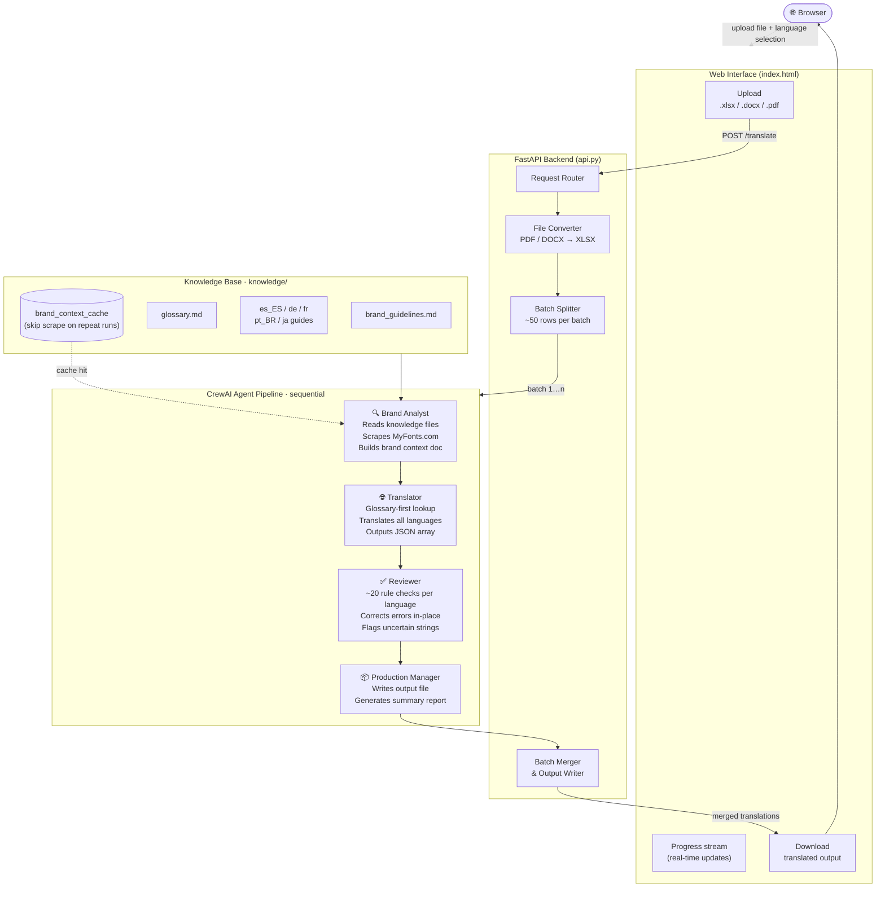
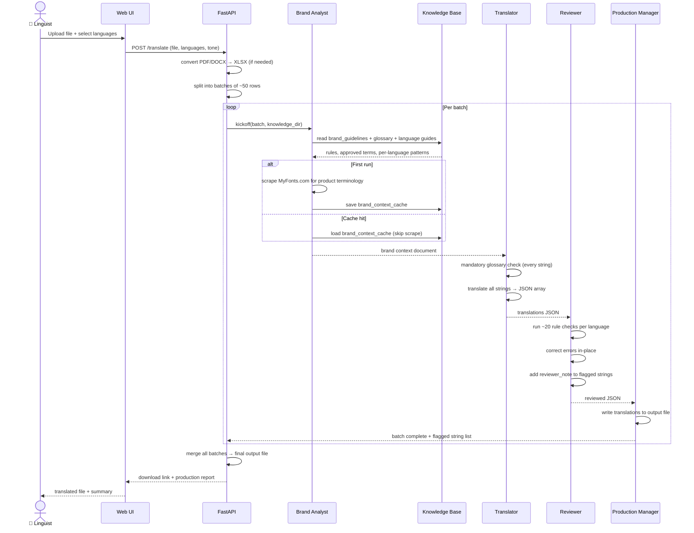

# Monotype Translation Crew

AI-powered translation pipeline built with CrewAI and FastAPI. Translates Monotype product UI strings from English into five languages simultaneously, enforcing brand terminology, per-language style rules, and approved glossary vocabulary throughout.

**Status:** Live prototype — actively used by Monotype linguist teams  
**Live tool:** https://huggingface.co/spaces/Sankalp546/Monotype_Translator  
**Maintained by:** Sankalp Khandelwal (sankalp.khandelwal@monotype.com)

---

## Business Impact

| Metric | Before (manual) | After (this tool) |
|--------|-----------------|-------------------|
| Time to translate 100 strings across 5 languages | 2–3 days | 3–5 minutes |
| Brand terminology consistency | Varies by linguist | Enforced by AI on every string |
| Style guide lookup | Manual, per string | Automated — ~20 rules checked per language |
| Linguist role | Full translation | Post-editing and quality assurance |

The tool does not replace linguists. It produces a strong first draft that linguists review, correct, and approve — shifting their effort from translation to quality assurance and significantly reducing turnaround time.

---

## Technology Stack

| Layer | Technology |
|-------|-----------|
| AI framework | CrewAI (multi-agent orchestration) |
| LLM | Configurable — OpenAI GPT-4.1 or equivalent |
| Backend | Python, FastAPI |
| Hosting | HuggingFace Spaces (Docker) |
| Input/output | openpyxl (Excel), python-docx (Word), pdfplumber (PDF) |
| Knowledge base | Markdown files (brand guidelines, glossary, per-language guides) |

---

## What It Does

The tool accepts an Excel, Word, or PDF file containing English source strings and returns a translated file with one column (or section) per selected language. It does not simply call a translation API — it runs a four-agent AI pipeline that reads Monotype's brand guidelines, enforces the approved glossary, applies per-language style rules, reviews every string for errors, and then writes the output.

**Target languages**

| Code | Language |
|------|----------|
| `fr` | French (fr-FR) — formal *vous* register |
| `de` | German (de-DE) — formal *Sie* register |
| `pt_BR` | Brazilian Portuguese — *você* register |
| `es_ES` | Spanish — Castilian (*tú* register) |
| `ja` | Japanese (ja-JP) — polite *teineigo* register |

**Supported input formats**

| Format | How it is processed |
|--------|---------------------|
| `.xlsx` | Strings read from Column A; translated columns written alongside |
| `.docx` | Paragraphs and table cells extracted, translated, written to new `.docx` files |
| `.pdf` | Tables and text lines extracted, converted to Excel for translation |

---

## Architecture

### System Overview



---

### A Typical Translation Job — Sequence



---

## Agent Pipeline

Four CrewAI agents run sequentially. Each has a single responsibility.

| Agent | Role |
|-------|------|
| **Brand Analyst** | Reads all knowledge files and scrapes MyFonts.com for current product terminology. Produces a brand context document used by all downstream agents. Result is cached — subsequent batches skip the web scrape. |
| **Translator** | Runs a mandatory glossary check on every string before translating. Uses exact approved translations for any term in the glossary. Outputs a structured JSON array covering all selected languages. |
| **Translation Reviewer** | Runs ~20 language-specific rule checks per string — accuracy, register, placeholder integrity, product name fidelity, dialog grammar, and vocabulary traps (e.g. German *vierteljährlich*, Japanese 件 counter, es-ES webkit vocabulary). Corrects errors in-place and flags uncertain strings. |
| **Production Manager** | Writes reviewed translations back into the output file. Produces a summary report with row counts per language and a list of any flagged strings. |

---

## Knowledge Base

All translation rules live in `knowledge/`. Agents load these files at runtime; updating a file takes effect on the next translation run.

```
knowledge/
├── brand_guidelines.md     # Tone of voice, untranslatable product names, placeholder rules
├── glossary.md             # Approved term translations across all 5 languages
├── es_ES_guide.md          # Castilian Spanish patterns, vocabulary, and style rules
├── de_guide.md             # German patterns and vocabulary
├── fr_guide.md             # French patterns and vocabulary
├── pt_BR_guide.md          # Brazilian Portuguese patterns and vocabulary
├── ja_guide.md             # Japanese UI conventions and counter rules
└── tm/                     # Translation Memory folder (reference — not yet wired into pipeline)
```

### Key rules encoded in the knowledge base

**Brand & product terms** — `brand_guidelines.md`  
Product names that must never be translated in any language: Monotype, MyFonts, Fonts.com, Monotype AI, Mosaic, SkyFonts, Anyword, Adobe Fonts, Google Fonts, and all other Monotype brand and platform names.

**Glossary** — `glossary.md`  
Approved translations for ~100 core typographic, UI, and SaaS terms across all 5 languages. Agents must use these exact translations — no alternatives, no paraphrasing.

**Per-language guides** — one file per language  
Cover register, button label grammar, confirmation dialog structure, error message patterns, and language-specific vocabulary traps. Examples:
- **es-ES**: webkit → "kit web"; offline (kit web state) → "invisible" (not "fuera de línea"); expiry date → "fecha de caducidad"; creative/delight strings must be idiomatically adapted, never word-for-word
- **pt-BR**: legibility → "leiturabilidade" (counterintuitive); readability → "legibilidade"; user → "usuário" (never "utilizador")
- **de-DE**: four distinct dialog verb patterns; "Font(s)" stays as English loanword; quarterly → "vierteljährlich"
- **fr-FR**: standalone buttons use infinitive (not *vous* imperative); "tags" stays as "tags" in all contexts
- **ja-JP**: count variables for users take 人 counter; font lifecycle "Leaving" = 提供終了 (retirement); button labels drop trailing する

---

## What Gets Enforced Automatically

| Rule category | Example |
|---------------|---------|
| Untranslatable product names | "Monotype AI", "Anyword", "Adobe Fonts" never translated |
| Placeholder integrity | `{{count}}`, `{name}`, `%s` copied verbatim into every language |
| Register | *tú* in es-ES, *vous* in fr-FR, *Sie* in de-DE, *você* in pt-BR, *丁寧語* in ja |
| Button label grammar | es-ES standalone buttons use infinitive, not *tú* imperative |
| Confirmation dialog structure | Consequence sentence first, question second (all languages) |
| webkit / web project vocabulary | es-ES: offline → "invisible", webkit → "kit web" |
| Expiry terminology | es-ES: always "caducidad", never "vencimiento" |
| Typography terms | Kerning stays "kerning" in es-ES; pt-BR swaps legibility/readability |
| Creative / delight strings | Idiomatically adapted in the target language, never literal |
| Japanese counters | `{{count}}` for items → 件; for users → 人 |
| Quotation marks | es-ES uses «»; de-DE uses „"; fr-FR uses « » |

---

## Setup

### Secrets

Set the following in your HuggingFace Space settings (Settings → Repository secrets):

| Secret | Description |
|--------|-------------|
| `OPENAI_API_KEY` | OpenAI API key used by CrewAI agents |
| `MODEL` | Model identifier, e.g. `openai/gpt-4.1-2025-04-14` |

### Local development

```bash
# Install uv (Python package manager)
curl -LsSf https://astral.sh/uv/install.sh | sh

# Install dependencies
uv sync

# Run the API locally
uv run uvicorn src.monotype_translation_crew.api:app --reload --port 7860
```

The UI is served at `http://localhost:7860`.

---

## How to Use

1. **Prepare input** — create an Excel file with English strings in Column A. A header row (`English`) is optional; the tool auto-inserts one if missing.
2. **Upload** — go to the tool URL and upload the `.xlsx`, `.docx`, or `.pdf` file.
3. **Select languages** — click the language chips to toggle which languages to include (all five selected by default).
4. **Enable UI Optimisation** (optional) — applies tighter rules for button labels, dialogs, and empty states.
5. **Translate** — click Translate. Progress streams in real time (typically 2–5 min for ~100 strings).
6. **Download** — the translated file downloads automatically when complete.

---

## Updating Translation Rules

All rules are in plain Markdown files under `knowledge/`. No code changes are needed to update vocabulary or patterns.

**To add a new approved term:**  
Add a row to the relevant table in `knowledge/glossary.md`. The term will be enforced from the next run.

**To add a per-language rule:**  
Edit the relevant language guide (e.g. `knowledge/es_ES_guide.md`). The reviewer agent reads these files and will apply the new rule.

**To add a new untranslatable product name:**  
Add it to the "Brand & Company Names" or "Product & Platform Names" list in `knowledge/brand_guidelines.md` and to the `## Untranslatable Brand & Product Names` table in `knowledge/glossary.md`.

**To update the knowledge base from linguist-approved translations:**  
Review the approved Excel files, extract new vocabulary patterns and terminology decisions, and write them directly into the relevant knowledge files. The `knowledge/tm/` folder is reserved for future Translation Memory integration.

---

## File Structure

```
monotype_translation_crew/
├── src/monotype_translation_crew/
│   ├── api.py              # FastAPI app — upload/translate/download endpoints
│   ├── crew.py             # CrewAI agent and task definitions
│   ├── main.py             # CLI entry point
│   ├── config/
│   │   ├── agents.yaml     # Agent roles, goals, and backstories
│   │   ├── tasks.yaml      # Task instructions for Excel/PDF translation
│   │   └── docx_tasks.yaml # Task instructions for Word document translation
│   └── tools/
│       ├── excel_tools.py  # Read/write Excel; brand context cache
│       └── docx_tools.py   # Read/write Word documents
├── knowledge/              # Brand rules, glossary, per-language guides
├── inputs/                 # Uploaded source files (runtime)
├── outputs/                # Translated output files (runtime)
├── index.html              # Single-page UI
└── Dockerfile              # HuggingFace Spaces deployment
```

---

## Architecture Notes

- **Brand context caching** — on first run the Brand Analyst reads all knowledge files and scrapes MyFonts.com, then saves the result to `outputs/brand_context_cache.txt`. Subsequent runs load from cache, skipping the web scrape. Delete the cache file to force a refresh.
- **Batch processing** — strings are translated in batches of ~50 rows to stay within LLM context limits. The Production Manager merges all batches before writing the output file.
- **Concurrent jobs** — the `reviewed_translations.json` interim file is shared. Running two jobs simultaneously will overwrite it. This is acceptable for single-team use; a job-ID-scoped file system would fix it for multi-user deployments.
- **docx pipeline** — Word files run through a separate `DocxTranslationCrew` that extracts paragraph text and table cells, translates them, and writes back one output `.docx` per target language.

---

## Known Limitations & Roadmap

| Item | Status |
|------|--------|
| Translation Memory (TM) integration — look up approved translations before calling the LLM | Planned |
| SSO / internal Monotype auth | Not yet — currently open prototype |
| Additional languages (es-419, zh-CN, ko-KR) | Planned |
| Multi-user job isolation (scoped output files) | Planned |
| Integration with Monotype Fonts localization pipeline | Under evaluation |
| Hosting on Monotype internal infrastructure | Requires IT support |

---

## Linguist Feedback Loop

When linguists post-edit the AI output, their corrections should be fed back into the knowledge base:

1. Compare the AI output column with the linguist-corrected column.
2. Identify patterns — terms consistently changed, constructions always rewritten, rules missing from the guides.
3. Add the new rules or vocabulary to the relevant `knowledge/` files.
4. The next translation run will apply them automatically.

Approved translation files from linguists are the authoritative source for terminology decisions. When a file is received, extract vocabulary and pattern updates and write them to the knowledge files — do not rely on the LLM to discover rules it was never given.
